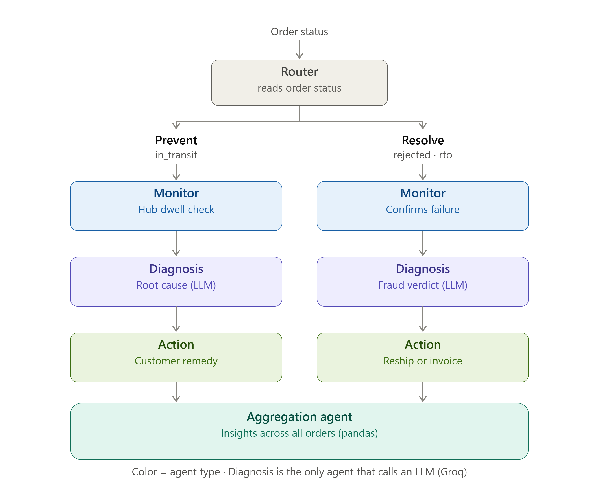

# Sanchar — AI Agent Pipeline for COD Delivery Intelligence

## Live Demo

- **Frontend:** https://sanchar-meesho.vercel.app
- **Backend API:** https://sanchar-meesho.onrender.com
- **Source code:** https://github.com/krishnapriya2401/SANCHAR-Meesho

Sanchar reduces Cash-on-Delivery (COD) delivery failures using a 4-agent AI pipeline. In India, 60–65% of e-commerce shoppers still use COD, and 20–30% of those orders get rejected — roughly 10x higher than prepaid — wasting an estimated ₹285 per order in two-way shipping. Sanchar targets the gap between an order shipping and a delivery failing: the one part of this problem an agentic system can actually influence.

## What it does

Sanchar runs two modes, routed automatically per order:

- **Mode 1 — Prevent** (`in_transit` orders): Monitor Agent catches shipments stuck at a hub past their expected dwell threshold. Diagnosis Agent identifies the likely cause — hub congestion, weather, or an address-verification hold. Action Agent decides the right proactive nudge (status update, wallet credit, cashback) before frustration turns into a rejection.
- **Mode 2 — Resolve** (`rejected` / `rto` orders): Monitor Agent confirms the failure type. Diagnosis Agent cross-checks the courier's stated reason against independent evidence — specifically, whether a call to the customer was actually logged — to catch **false claims**. Action Agent triggers the remedy: free reshipment for genuine failures, courier invoice for false claims.

A fourth agent, **Aggregation**, studies patterns across *all* orders at once — not one at a time — producing operational insights: root-cause breakdown, regional risk, delay distribution, financial impact per action type, and false-claim rates by region. This was deliberately redesigned away from an earlier "flag one courier for punishment" after realizing that accusing  a single delivery partner based on aggregate fault rate isn't a fair or realistic real-world lever — the system now surfaces *insights for a human to act on*, rather than making that call unilaterally.

## Architecture





Built as a real [LangGraph](https://github.com/langchain-ai/langgraph) `StateGraph` — a router node reads each order's status and dispatches it down the Prevent or Resolve chain; each agent is a graph node passing an evolving state object forward.

## Where the LLM is actually used — and where it isn't

This is worth being precise about, since it's core to the design:

- **Monitor and Action are pure deterministic Python.** Threshold comparisons, rule-based remedy selection. No ambiguity, no LLM needed.
- **Diagnosis is the only per-order agent that calls an LLM** ([Groq](https://groq.com/), Llama 3.3 70B) — specifically for generating the natural-language explanation of a cause or verdict. The verdict/cause *itself* is always decided by deterministic logic first (e.g., the fraud check is a straightforward comparison: did the courier claim "customer unavailable" while no call was ever logged?) — the LLM never decides the verdict, only explains it in plain language.
- **Aggregation Agent's per-order stats are pure pandas** (no LLM) — only its final executive summary sentence is LLM-generated, synthesizing already-computed numbers into plain English.

Every LLM call is wrapped with a fallback: if Groq times out, rate-limits, or returns malformed output, the pipeline falls back to a template sentence rather than crashing. The system never depends on the LLM being available to function correctly.

## Tech stack

| Layer | Technology |
|---|---|
| Frontend | React + Vite |
| Backend | Django + Django REST Framework |
| Agent orchestration | LangGraph |
| LLM | Groq (Llama 3.3 70B) |
| Database | PostgreSQL (Render, production) / SQLite (local dev) |
| Hosting | Render (backend) + Vercel (frontend) |

 "Email pipeline exists but delivery depends on SMTP provider availability on free-tier hosts."
 Why this stack

## Why this stack

- **Django + DRF** — one framework for models, REST API, and batch pipeline commands (`generate_data`, `run_pipeline`), instead of assembling an ORM, migrations, and job runner separately.
- **LangGraph** — the pipeline branches by order status and shares typed state across agents; `StateGraph` models that directly instead of hand-rolling a state machine.
- **Groq (Llama 3.3 70B)** — fast inference for live, per-order calls during a demo, where a visible delay matters more than marginal quality differences.
- **PostgreSQL (production) / SQLite (local)** — Postgres handles concurrent API reads while the pipeline writes results, and Render's free Postgres persists independently of the web service, surviving redeploys.
- **React + Vite + react-router-dom** — component-based views (Dashboard, Order Detail, Scorecard) with fast local iteration during a 7-day build.
- **Render + Vercel** — zero-config deploys from GitHub, free tiers sufficient for a hackathon prototype, no manual server/DNS/SSL setup needed.
## Project structure

```
sanchar_backend/
├── core/
│   ├── agents/
│   │   ├── monitor.py       # hub dwell threshold checks (Prevent), failure confirmation (Resolve)
│   │   ├── diagnosis.py     # root cause / fraud verdict — deterministic logic + Groq explanation
│   │   ├── action.py        # remedy selection
│   │   ├── aggregation.py   # cross-order pandas analytics + executive summary
│   │   ├── graph.py         # LangGraph StateGraph definition
│   │   └── state.py         # shared TypedDict schema for the pipeline
│   ├── management/commands/
│   │   ├── generate_data.py # synthetic order generator
│   │   └── run_pipeline.py  # batch-runs the graph across all orders
│   ├── models.py
│   ├── serializers.py
│   ├── views.py
│   └── urls.py
└── sanchar_backend/
    ├── settings.py
    └── urls.py

sanchar-frontend/
├── src/
│   ├── views/          # Dashboard, OrderDetail, Scorecard
│   ├── components/     # AgentTraceConsole, ApprovalModal, Toast, etc.
│   ├── api.js
│   └── App.jsx
```

## Synthetic data

Real courier/call-log data isn't available for a hackathon build — no team has production access to courier telephony systems or live order feeds in a one-week window. Sanchar generates ~180 realistic synthetic orders instead, across 5 couriers and 6 city pincodes, with:

- Delay timing seeded to land 2–10 hours past each courier's specific hub-dwell threshold (not a wide random spread), so Monitor Agent's detection reads believably in a demo.
- Deliberately seeded **false-claim fraud cases** — orders where the courier reports "customer unavailable" but no call was ever logged — which is exactly the mismatch Diagnosis Agent is built to catch.
- **Courier-specific false-claim bias**, so the Aggregation scorecard shows a real, differentiated pattern across couriers rather than flat, uninformative numbers.

This is disclosed intentionally, not hidden — the reasoning layer (Monitor's threshold logic, Diagnosis's fraud cross-check, Aggregation's pattern analysis) is real and would run unchanged against production data; only the data source is synthetic.

## Local setup

### Backend

```bash
cd sanchar_backend
python -m venv venv
source venv/bin/activate        # Windows: venv\Scripts\activate
pip install -r requirements.txt
cp .env.example .env            # add GROQ_API_KEY at minimum
python manage.py migrate
python manage.py generate_data
python manage.py run_pipeline
python manage.py runserver
```

### Frontend

```bash
cd sanchar-frontend
npm install
echo VITE_API_BASE=http://localhost:8000 > .env
npm run dev
```

## Deployment

**Backend (Render):**
1. Push to GitHub.
2. New Web Service → root directory `sanchar_backend`.
3. Build command: `pip install -r requirements.txt && python manage.py migrate`
4. Start command: `gunicorn sanchar_backend.wsgi --bind 0.0.0.0:$PORT`
5. Add environment variables (see table below).
6. Render's free tier has no shell access, so seeding is done via a protected endpoint (`POST /api/setup/`, key-gated) rather than a manual management command.
7. A free external cron job (e.g. cron-job.org) pings a lightweight endpoint every 5 minutes to keep the free-tier instance warm and avoid cold-start delay during judging.

**Frontend (Vercel):**
1. Import repo → root directory `sanchar-frontend`.
2. Set `VITE_API_BASE` to the deployed Render URL.
3. Deploy.

## API endpoints

| Method | Path | Description |
|---|---|---|
| GET | `/api/orders/` | List orders, optional `?status=` filter |
| GET | `/api/orders/:id/` | Full order detail, including agent trace |
| POST | `/api/orders/:id/rerun-live/` | Re-invoke the real pipeline live on one order |
| GET | `/api/aggregation/` | Scorecard and cross-order insights |
| POST | `/api/setup/` | Seed + run pipeline (key-gated, used since Render's free tier has no shell) |

## Environment variables

| Key | Required | Notes |
|---|---|---|
| `GROQ_API_KEY` | Yes | Diagnosis Agent's LLM calls |
| `DATABASE_URL` | No | Defaults to SQLite locally; set to Postgres in production |
| `SETUP_KEY` | Production only | Protects the `/api/setup/` seeding endpoint |
| `DEBUG` | No | Set `False` in production |

## Known limitations (disclosed intentionally)

- **Data is synthetic**, for the reasons above — no courier partnership exists to source real call-log or delivery-attempt data in a 7-day build.
- **Action Agent's remedies are recorded decisions, not real integrations** — there's no live courier/OMS API connected. This is a standard integration boundary, not a shortcut: the reasoning layer is what's being demonstrated.
- **Email notification exists in the pipeline but delivery is not demo-reliable.** Render's free tier blocks outbound SMTP, so email routes through SendGrid's HTTPS API instead. SendGrid confirms successful delivery handoff, but as a new, unauthenticated sending domain, messages are inconsistently filtered by some inbox providers before reaching an inbox. Resolving this fully requires DNS-level domain authentication (SPF/DKIM) on an owned domain, which wasn't feasible within the build window.
- **Aggregation's insight cards use a mix of real per-order values (e.g. courier invoice amounts) and flat cost estimates (e.g. wallet credit, reshipment cost)** — a reasonable simplification for a prototype, not a fully itemized cost model.

## Open-source attribution

| Library | License | Role |
|---|---|---|
| [Django](https://www.djangoproject.com/) | BSD-3-Clause | Backend framework |
| [Django REST Framework](https://www.django-rest-framework.org/) | BSD-3-Clause | API layer |
| [LangGraph](https://github.com/langchain-ai/langgraph) | MIT | Agent pipeline orchestration |
| [Groq SDK](https://github.com/groq/groq-python) | Apache 2.0 | LLM inference client |
| [pandas](https://pandas.pydata.org/) | BSD-3-Clause | Aggregation analytics |
| [React](https://react.dev/) | MIT | Frontend framework |
| [Vite](https://vitejs.dev/) | MIT | Frontend build tool |
| [axios](https://axios-http.com/) | MIT | HTTP client |

Built by Krishna Priya S for Meesho's ScriptedBy{Her} Hackathon.
